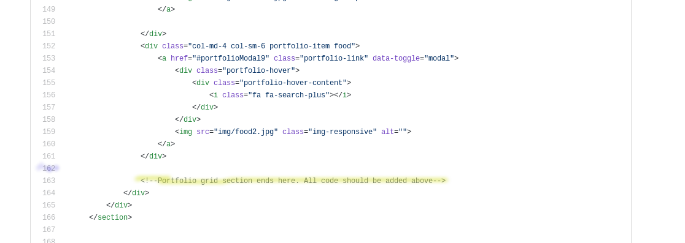
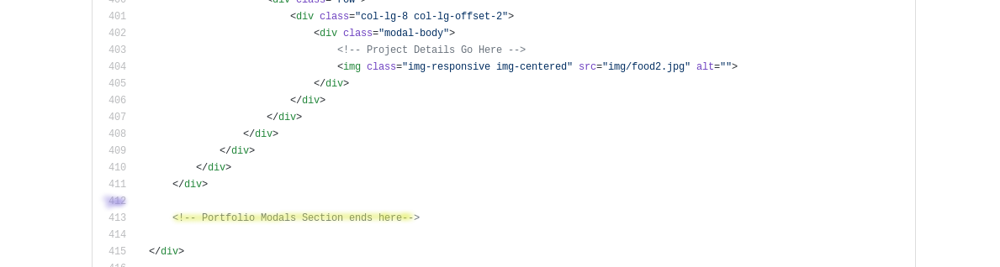
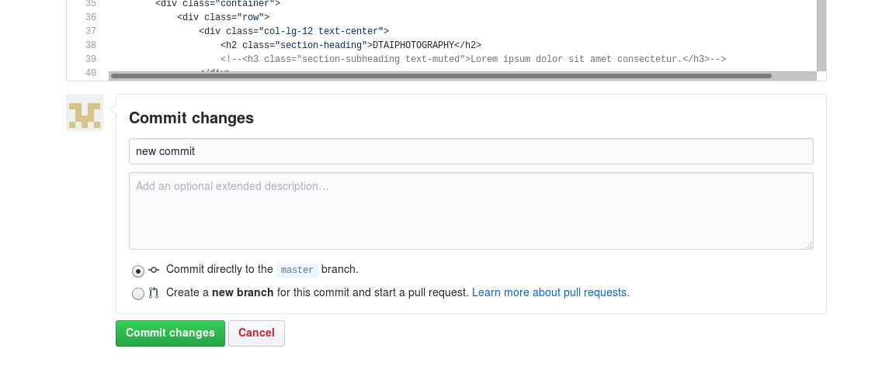

# dtai photography website instructions

## Step 1: Uploading a new photo

To add photos, navigate to the /img folder and click
"Upload files" in the top-left corner. Upload files from your local
PC to the server in this way. Note that the images will not appear on
the page until the appropriate html code has been added. This process must
be repeated for each new image.

## Step 2: Adding HTML

There are 2 sections in the *index.html* file to edit upon uploading a photo.
To begin this process, click the *index.html* file link above and then click the edit icon
in the top-right corner.

### Step 2.1: Portfolio Grid Section

Scroll down until you encounter the comment

```html
<!--Portfolio grid section ends here. All code should be added above-->
```

which is located on line 163 at the time of writing and in the image below.



Beginning on the line directly above the comment (line 162 in the above image),
insert the following code snippet by copying and pasting:

```html
<div class="col-md-4 col-sm-6 portfolio-item food">
     <a href="#portfolioModalYOUR_NUMBER" class="portfolio-link" data-toggle="modal">
         <div class="portfolio-hover">
             <div class="portfolio-hover-content">
                 <i class="fa fa-search-plus"></i>
             </div>
         </div>
         
     </a>
</div>
```

where there are two variables to replace, **YOUR_NUMBER** and **YOUR_PIC**.
For the first variable, insert a number which has not been used previously.
At the time of writing, the numbers 1-9 have been used and therefore a logical
choice would be **YOUR_NUMBER** = 10. Replace the text with your chosen number,
which is 10 in this example, and remember it.

For the **YOUR_PIC** variable, replace the text with the file name of the
image you uploaded in Step 1. (The above code snippet assumes the file format
is jpg but you can change the file extension if necessary.)

### Step 2.2: Portfolio Modals Section

Scroll down until you encounter the comment

```html
 <!-- Portfolio Modals Section ends here-->
```

which is located on line 413 at the time of writing and in the image below.



Beginning on the line directly above the comment (line 412 in the above image),
insert the following code snippet by copying and pasting:

```html
<!-- Portfolio Modal YOUR_NUMBER -->
<div class="portfolio-modal modal fade" id="portfolioModalYOUR_NUMBER" tabindex="-1" role="dialog" aria-hidden="true" style="display: none;">
     <div class="modal-dialog">
         <div class="modal-content">
             <div class="close-modal" data-dismiss="modal">
                 <div class="lr">
                     <div class="rl">
                     </div>
                 </div>
             </div>
             <div class="container">
                 <div class="row">
                     <div class="col-lg-8 col-lg-offset-2">
                         <div class="modal-body">
                             <!-- Project Details Go Here -->
                             
                         </div>
                     </div>
                 </div>
             </div>
         </div>
     </div>
</div>
```

Once again, there are 2 variables to replace **YOUR_NUMBER** and **YOUR_PIC**.
(YOUR_NUMBER occurs twice in this snippet.) Using the same values
you used previously in Step 2.1, replace the text for these variables.

## Step 3: Commit Changes

When you are finished, scroll all the way to the bottom and commit your changes by first typing a
short (meaningless) description in the box that says "Update index.html" and then clicking on
the green "Commit Changes" button. The option "commit directly to master branch" should be selected.



Your changes should now appear on the website after refreshing the page!
